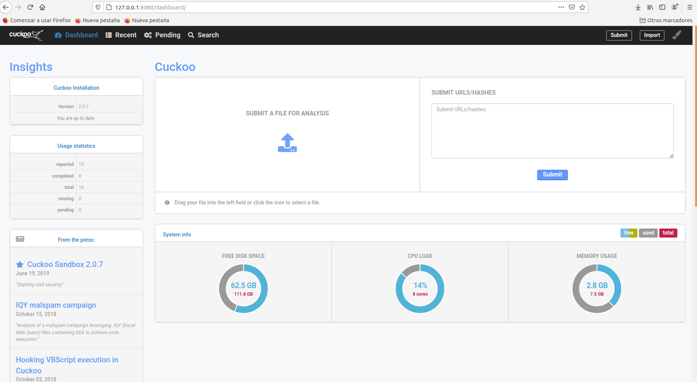
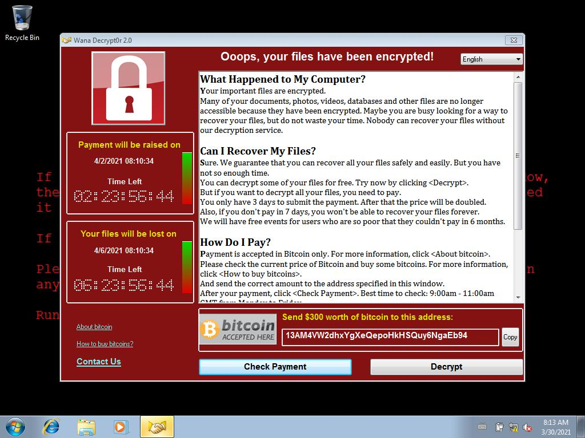
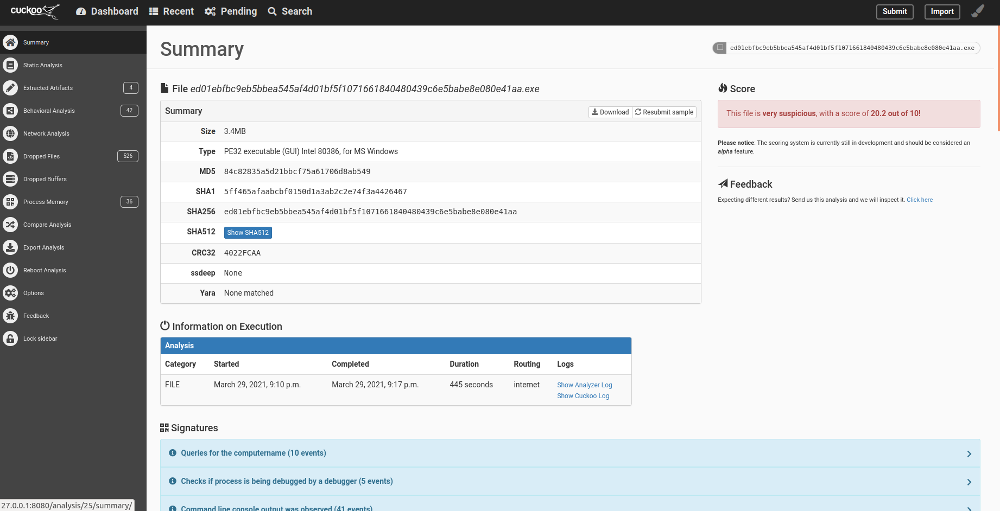

# Montaje de laboratorio y análisis de una muestra

## Laboratorio de análisis

<details><summary>Expandir</summary>
La máquina anfitrión será un ordenador con sistema operativo **Linux**, utilizando la distribución **Ubuntu** en la versión **18.04.5 LTS**.

Se necesitan una serie de requisitos para la instalación y el correcto funcionamiento de Cuckoo.

Será necesario tener la versión adecuada de **Python** (actualmente soporta Python 2.7) e instalar una serie de bibliotecas:

```shell
$ sudo apt-get install python python-pip python-dev libffi-dev libssl-dev
$ sudo apt-get install python-virtualenv python-setuptools
$ sudo apt-get install libjpeg-dev zlib1g-dev swig
```    

Para poder utilizar la interfaz web **Django** y **PostgreSQL** como base de datos, se necesita **MongoDB** y **PostgreSQL**:

```shell
$ sudo apt-get install mongodb
$ sudo apt-get install postgresql libpq-dev
```

Las máquinas virtuales basadas en Windows 7 donde se ejecutarán las muestras de malware serán generadas a través de **VirtualBox**, un software de virtualización muy completo el cual está soportado por Cuckoo Sandbox, aunque se puede utilizar otro software de virtualización. En este caso se utiliza la **versión 5.2.42 de VirtualBox**, la cual se puede descargar e instalar desde la página oficial o utilizando los comandos siguientes:

```shell
$ echo deb http://download.virtualbox.org/virtualbox/debian xenial contrib | sudo tee -a /etc/apt/sources.list.d/virtualbox.list
$ wget -q https://www.virtualbox.org/download/oracle_vbox_2016.asc -O- | sudo apt-key add -
$ sudo apt-get update
$ sudo apt-get install virtualbox-5.2
```
Para poder obtener información de la actividad de red del malware se recurre a **tcpdump**, que rastreará la red para capturar el tráfico a la hora de analizar una muestra.

```shell
$ sudo apt-get install tcpdump apparmor-utils
```

Esta herramienta necesita privilegios de superusuario, los cuales les serán otorgados únicamente a ella y no a Cuckoo Sandbox:

```shell
$ sudo groupadd pcap

$ sudo usermod -a -G pcap (nombre_usuario)
$ sudo chgrp pcap /usr/sbin/tcpdump
$ sudo setcap cap_net_raw,cap_net_admin=eip /usr/sbin/tcpdump
$ sudo aa-disable /usr/sbin/tcpdump
```

Tras esto, se instala **M2crypto**, un módulo de Python que será necesario para el análisis de muestras:

```shell
$ sudo pip install m2crypto
```

En este caso, se utiliza VirtualBox y será necesario incluir al usuario con el que se ejecuta Cuckoo en el grupo `vboxusers`, para que Cuckoo pueda identificar las máquinas virtuales:

```shell
$ sudo usermod -a -G vboxusers (nombre_usuario)
```

A continuación, se crea un entorno virtual, para añadir otro factor más de seguridad al laboratorio y en este entorno será donde posteriormente se instale Cuckoo Sandbox y se trabaje. Para ello, descargamos un [script bash de GitHub](https://gist.github.com/jstrosch/de20131dda2aac5cd1116dd44b8f2474#file-cuckoo-setup-virtualenv-sh) el cual sirve para instalar esta funcionalidad: 

```shell
$ sudo -u <USERNAME> cuckoo-setup-virtualenv.sh
```

Una vez instalada esta herramienta, se crea un entorno virtual, en el caso de este trabajo se le ha dado el nombre de `cuckoo-test` y llegados a este punto, siempre se trabajará dentro de este entorno, por lo que será muy importante asegurarse de que estamos dentro del entorno virtual al utilizar un terminal.

```shell
$ mkvirtualenv -p python2.7 cuckoo-test
```

Tras la ejecución del comando anterior, se estará trabajando dentro de un entorno virtual donde se realizan el resto de pasos. Primero se requiere la actualización de los módulos **pip** y **setuptools** y después, se procede a la instalación de **Cuckoo Sandbox**:

```shell
(cuckoo-test) $ pip install -U pip setuptools
(cuckoo-test) $ pip install -U cuckoo
```

A continuación, se deberá descargar una ISO de Windows 7 y se monta [Hatching](https://hatching.io/blog/cuckoo-sandbox-setup/):

```shell
(cuckoo-test) $ wget https://cuckoo.sh/win7ultimate.iso
(cuckoo-test) $ mkdir /mnt/win7
(cuckoo-test) $ sudo mount -o ro,loop win7ultimate.iso /mnt/win7
```

Para gestionar la creación de máquinas virtuales para Cuckoo, el software que usan y la captura de estados, el uso de la herramienta **VMCloak** facilitará estas tareas ya que está diseñada para crear máquinas virtuales que Cuckoo Sandbox pueda utilizar. Es necesario instalar algunos paquetes previos para la correcta integración con Cuckoo, y después instalar VMCloak [Hatching](https://hatching.io/blog/cuckoo-sandbox-setup/):

```shell
(cuckoo-test) $sudo apt-get -y install build-essential libssl-dev libffi-dev \ 
python-dev genisoimage
(cuckoo-test) $ sudo apt-get -y install zlib1g-dev libjpeg-dev
(cuckoo-test) $ sudo apt-get -y install python-pip python-virtualenv \ 
python-setuptools swig

(cuckoo-test) $ pip install -U vmcloak
```

Una vez la herramienta está instalada, se crea una interfaz de red a la que se conectarán las máquinas virtuales, se configura la ISO montada previamente con las características adecuadas (en este caso, serán máquinas virtuales con **2 CPUs** y una **memoria RAM de 2048MB**) utilizando los siguientes comandos [Hatching](https://hatching.io/blog/cuckoo-sandbox-setup/):

```shell
(cuckoo-test) $ vmcloak-vboxnet0 
(cuckoo-test) $ vmcloak init --verbose --win7x64 win7x64base --cpus 2 --ramsize 2048
```

El siguiente paso es instalar el software necesario, que una vez creados los estados de la imagen, no se podrá modificar, por eso, el primer paso será clonar la máquina en su versión original vacía, para instalar software ahí y guardar los estados. 
Entre el software que necesario para las máquinas encontramos **java**, **adobepdf**, **flash** y **pillow** (este último será el paquete que realice capturas de pantalla durante el análisis del malware) [Hatching](https://hatching.io/blog/cuckoo-sandbox-setup/):

```shell
(cuckoo-test) $ vmcloak clone win7x64base cuckooVM
(cuckoo-test) $ vmcloak install cuckooVM adobepdf dotnet java flash vcredist vcredist.version=2015u3 wallpaper
(cuckoo-test) $ vmcloak install cuckooVM pillow
```

Llegados a este punto, se crean los estados de la máquina virtual. Dadas las características del equipo en el que se está construyendo el laboratorio de análisis de malware, se crean 3 estados, lo que permitirá realizar un máximo de 3 análisis simultáneos. Con el siguiente comando, se crearán 3 máquinas virtuales con IPs 192.168.56.101, 192.168.56.102 y 192.168.56.103 [Hatching](https://hatching.io/blog/cuckoo-sandbox-setup/):

```shell
(cuckoo-test) $ vmcloak snapshot --count 3 cuckooVM 192.168.56.101
```

Con todo lo realizado hasta ahora, el laboratorio está casi preparado y únicamente quedaría configurar Cuckoo Sandbox para ponerlo a funcionar. Para ello es necesario iniciar cuckoo, que mostrará por defecto el directorio de trabajo `/home/nombre_usuario/.cuckoo`, este directorio se podrá modificar sin problema, aunque en el caso de este proyecto, se trabajará en el definido por defecto. 

```shell
(cuckoo-test) $ cuckoo init
(cuckoo-test) $ cuckoo community
```

También será necesario modificar los ficheros de configuración de Cuckoo, que se encuentran en la carpeta `conf` dentro del directorio principal de trabajo, personalizando los ajustes y configurando las máquinas virtuales.

En primer lugar, la edición del fichero `virtualbox.conf` que contiene opciones sobre el software de virtualización, en este caso, se edita el campo `mode` que por defecto tendrá el valor `headless` y pone el valor `gui`. Este cambio permitirá ver la máquina virtual en ejecución cuando se realice un análisis, si por el contrario se quiere ver únicamente el resultado final y no lo que va sucediendo, se mantendrá el valor `headless`. El fichero quedaría de la siguiente manera:

    [virtualbox]
    # Specify which VirtualBox mode you want to run your machines on.
    # Can be "gui" or "headless". Please refer to VirtualBox's official
    # documentation to understand the differences.
    mode = gui

Con el siguiente comando, que modificará el fichero anterior, se añaden las máquinas virtuales creadas a Cuckoo con su configuración [Hatching](https://hatching.io/blog/cuckoo-sandbox-setup/).

```shell
(cuckoo-test) $ while read -r vm ip; do cuckoo machine --add $vm $ip; done < <(vmcloak list vms)
```

El resultado del fichero será el siguiente:

    # Specify the label name of the current machine as specified in your
    # VirtualBox configuration.
    label = 192.168.56.1011

    # Specify the operating system platform used by current machine
    # [windows/darwin/linux].
    platform = windows

    # Specify the IP address of the current virtual machine. Make sure that the
    # IP address is valid and that the host machine is able to reach it. If not,
    # the analysis will fail.
    ip = 192.168.56.101

    # (Optional) Specify the snapshot name to use. If you do not specify a
    # snapshot name, the VirtualBox MachineManager will use the current snapshot
    # Example (Snapshot1 is the snapshot name):
    snapshot = 

    # (Optional) Specify the name of the network interface that should be used
    # when dumping network traffic from this machine with tcpdump. If specified,
    # overrides the default interface specified in auxiliary.conf
    # Example (vboxnet0 is the interface name):
    interface = 

    # (Optional) Specify the IP of the Result Server, as your virtual machine 
    # sees it.
    # The Result Server will always bind to the address and port specified in
    # cuckoo.conf, however you could set up your virtual network to use NAT/PAT,
    # so you can specify here the IP address for the Result Server as your 
    # machine sees it. If you don't specify an address here, the machine will 
    # use the default value from cuckoo.conf.
    # NOTE: if you set this option you have to set result server IP to 0.0.0.0 
    # in cuckoo.conf.
    # Example:
    resultserver_ip = 192.168.56.1

    # (Optional) Specify the port for the Result Server, as your virtual machine
    # sees it. The Result Server will always bind to the address and port 
    # specified in cuckoo.conf, however you could set up your virtual network 
    # to use NAT/PAT, so you can specify here the port for the Result Server as 
    # your machine sees it. If you don't specify a port here, the machine will 
    # use the default value from cuckoo.conf.
    # Example:
    resultserver_port = 0

    # (Optional) Set your own tags. These are comma separated and help to
    # identify specific VMs. You can run samples on VMs with tag you require.
    tags = 

    # Mostly unused for now. Please don't fill it out.
    options = 

    # (Optional) Specify the OS profile to be used by volatility for this
    # virtual machine. This will override the guest_profile variable in
    # memory.conf which solves the problem of having multiple types of VMs
    # and properly determining which profile to use.
    osprofile = 

    [192.168.56.1012]
    .
    .
    . 

Hecho esto, se quiere dar acceso a Internet a las máquinas de análisis y para ello, es necesario activar la redirección de paquetes (*forwarding*) en la interfaz creada para VirtualBox y en la interfaz de salida (que en este caso es `wlo1`, pero puede ser `eth0` u otra, dependiendo del sistema).

La conexión a Internet es importante para que las muestras de malware muestren su comportamiento completo en los análisis, ya que que se conecten a la red es algo básico en la mayoría de ellas [Hatching](https://hatching.io/blog/cuckoo-sandbox-setup/):

```shell
(cuckoo-test) $ sudo sysctl -w net.ipv4.conf.vboxnet0.forwarding=1
(cuckoo-test) $ sudo sysctl -w net.ipv4.conf.wlo1.forwarding=1
```

Otro aspecto a configurar de Cuckoo, es el módulo `rooter`, que concede a Cuckoo ciertos permisos para trabajar con comandos de red y poder realizar análisis con opciones de encaminamiento y así sacar el máximo partido a análisis:

```shell
(cuckoo-test) $ cuckoo rooter --sudo --group gonzalo
```

Por último, antes de poder iniciar la interfaz web de Cuckoo Sandbox y empezar a realizar análisis, los últimos ficheros que necesitan edición son el fichero `routing.conf`, cambiando el apartado `internet` con valor `none` y dándole el nuevo valor `wlo1` (la interfaz de red) y el fichero `reporting.conf` cambiando el valor de `enabled` en el apartado `mongodb` de `no` a `yes` [Hatching](https://hatching.io/blog/cuckoo-sandbox-setup/).

    [routing]
    # Network interface that allows a VM to connect to the entire internet, the
    # "dirty line" so to say. Note that, just like with the VPNs, this will allow
    # malicious traffic through your network. So think twice before enabling it.
    # (For example, to use eth0 as dirty line: "internet = eth0").
    internet = wlo1


    [mongodb]
    enabled = yes
    host = 127.0.0.1
    port = 27017
    db = cuckoo
    store_memdump = yes
    paginate = 100
    # MongoDB authentication (optional).
    username = 
    password = 

Con el laboratorio puesto a punto, ya es posible realizar el análisis de las muestras para obtener parte de los datos que serán procesados para alimentar el modelo de ML. El análisis de una muestra usando Cuckoo Sandbox se detalla en el Anexo.
</details>

## Análisis de una muestra 

<details><summary>Expandir</summary>

Configurada la herramienta, se podrán realizar análisis en el laboratorio construido utilizando **Cuckoo Sandbox**. Para ello, es necesario ejecutar una serie de comandos para iniciar correctamente el entorno cada vez que el sistema sea reiniciado:


1. En cada terminal que se abra para trabajar, iniciar el entorno virtual “cuckoo-test”: 
    ```shell
    $ workon cuckoo-test
    ```
2. Activar forwarding para la interfaz de red:
    ```shell
    (cuckoo-test) $ sudo sysctl -w net.ipv4.conf.wlo1.forwarding=1
    ```
3. Crear interfaz con VMCloak:
    ```shell
    (cuckoo-test) $ vmcloak-vboxnet0
    ```
4. Ejecutar Cuckoo Rooter:
    ```shell
    (cuckoo-test) $ cuckoo rooter --sudo --group gonzalo
    ```
5. Ejecutar Cuckoo:
    ```shell
    (cuckoo-test) $ cuckoo
    ```
6. Ejecutar Cuckoo Web:
    ```shell
    (cuckoo-test) $ cuckoo web --host 127.0.0.1 --port 8080
    ```

Una vez ejecutados estos comandos, si se accede en el navegador a la dirección 127.0.0.1:8080 se encontrará la página principal de la interfaz web de Cuckoo Sandbox, como muestra la siguiente Figura, donde aparece información de la versión de la herramienta, detalles sobre el uso de memoria y otros. Además, desde aquí será posible subir una muestra para su análisis.

<p align="center">
    
</p>
<p align="center">
    <em>Pantalla principal Cuckoo Sandbox</em>
</p>

Al subir un archivo de malware para analizar, es posible configurar las opciones del análisis para todas las muestras o personalizar cada una. Entre las opciones, la que más interesa es la de "Internet" dentro de "Network Routing", para permitir al proceso acceder a conexión a Internet durante la ejecución. En la Figura que aparece a continuación se pueden observar distintas opciones de configuración.

<p align="center">
    
</p>
<p align="center">
    <em>Configuración del análisis</em>
</p>

Después de configurar las opciones, pulsando en "Analyze" comenzará el análisis y se podrá observar cómo se abre la máquina virtual de Windows 7 y comienza la ejecución, viendo en todo momento qué va ocurriendo. Si se decide cambiar la configuración de Cuckoo para que no aparezcan las máquinas virtuales, no se podrá observer el comportamiento en directo de la muestra pero al haber instalado la herramienta "pillow" en las máquinas virtuales, se realizarán capturas de pantalla de lo que está ocurriendo.

En las Figuras insertadas a continuación, se pueden observar capturas de pantalla realizadas durante el proceso de análisis que muestran un aviso de equipo infectado y una pantalla de instrucciones para el pago del rescate por la encriptación.

<p align="center">
    
</p>
<p align="center">
    <em>Aviso de malware</em>
</p>

<p align="center">
    
</p>
<p align="center">
    <em>Pantalla de pago del rescate</em>
</p>

Al terminar, la máquina virtual se cerrará y en el navegador se podrán visualizar los resultados del análisis, con la puntuación obtenida, detalles técnicos sobre la muestra, capturas de pantalla, información sobre los eventos y su peligrosidad y un menú lateral para acceder a distintas características, entre otras cosas, tal y como se muestra en las Figuras siguientes:

<p align="center">
    
</p>
<p align="center">
    <em>Resultados de análisis 1</em>
</p>

<p align="center">
    
</p>
<p align="center">
    <em>Resultados de análisis 2</em>
</p>

Toda esta información que se encuentra en la interfaz web, estará también en la carpeta `storage` dentro del directorio principal de trabajo de Cuckoo, organizada por carpetas para cada muestra, y repartida en sus correspondientes archivos de extensión `.log`, `.json`, `.pcap`...
</details>
